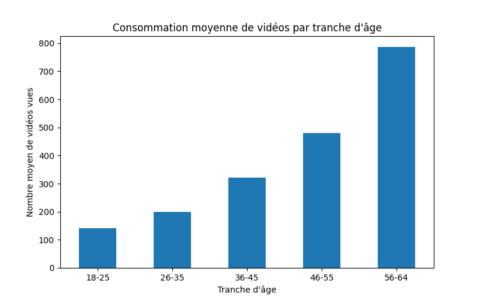

# Analyse du comportement d’utilisateurs sur un réseau social

## Présentation du projet

Ce projet consiste en une analyse exploratoire de données (EDA) réalisée en Python à partir d’un dataset simulant le comportement de 5000 utilisateurs sur une plateforme de réseau social.

L’objectif était d’explorer les relations entre différentes variables liées :
- au profil des utilisateurs ;
- à leur activité sur la plateforme ;
- à leur niveau d’engagement.

---

## Outils utilisés

- Python
- Pandas
- Matplotlib
- Jupyter Notebook

---

## Étapes de l’analyse

### Nettoyage des données
- traitement des valeurs manquantes ;
- harmonisation des variables catégorielles ;
- conversion des colonnes numériques ;
- détection et correction de valeurs aberrantes.

### Analyse exploratoire
- visualisation des relations entre variables ;
- analyse des corrélations ;
- identification de relations significatives entre certaines variables.

---

## Corrélations observées

Quelques relations mises en évidence dans le dataset :

| Variables | Corrélation de Spearman |
|---|---|
| age ↔ video_views | 0.751 |
| time_on_platform ↔ ads_clicked | 0.908 |
| photos_posted ↔ likes | 0.867 |
| reactions_given ↔ reactions_received | 0.844 |
| messages_sent ↔ messages_received | 0.820 |

---

## Observations intéressantes

L’analyse a notamment révélé :
- une forte relation entre l’âge et le nombre de vidéos vues ;
- un lien marqué entre le temps passé sur la plateforme et les clics sur les publicités ;
- un motif caché formant le mot "WORLD" lors de la visualisation des coordonnées géographiques.

## Exemple de visualisation

### Consommation moyenne de vidéos par tranche d’âge

Ce graphique montre que le nombre moyen de vidéos vues augmente avec l’âge des utilisateurs.

---

## Notebook du projet

Le notebook principal du projet est disponible ici :

- `AnalyseDonnees.ipynb`

---

## Auteur

Projet réalisé dans le cadre d’une SAE d’analyse de données.
